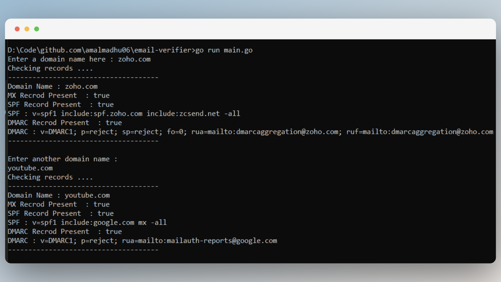

# Email Verifier

### A simple but useful email domain verifier built using standard libraries in Go. It takes domain name and check if it is a valid domain





## Run Locally

Clone the project

```bash
  git clone https://github.com/amalmadhu06/email-verifier-go
```

Go to the project directory

```bash
  cd email-verifier-go
```

Start the server

```bash
  go run main.go
```


## Acknowledgements

- [Akhil Sharma](https://www.youtube.com/@AkhilSharmaTech)